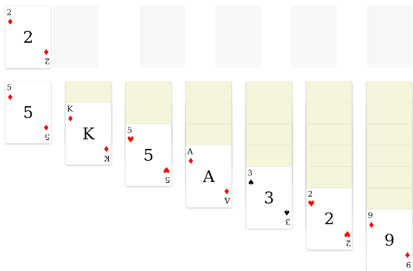

# Elm Klondike Solitaire


A card solitaire game written in Elm, in the spirit of MS' early solitaire.



Try it out now: https://loving-brahmagupta-7b820c.netlify.app/

## Install dependencies & run locally

1. Use node 18 and install dependencies:

```sh
nvm use 18
npm install -g yarn
yarn install
```

2. Start an `elm-live` dev server serving Elm Klondike Solitaire:

```sh
yarn start
```
